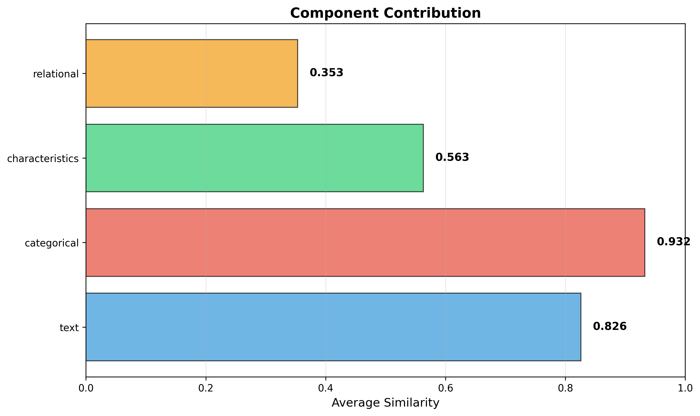

# SAP Material Embeddings

Generate embeddings for SAP material master data using **text-only** and **multimodal** approaches.

Provides reusable utilities for semantic similarity, duplicate detection, classification features, and material search.

---

## 🎯 What This Repository Provides

- **Text embeddings** for SAP material descriptions (baseline)
- **Multimodal embeddings** combining text, categories, characteristics, and usage patterns
- **Semantic similarity** search and analysis
- **Duplicate detection** with 1481% improvement over text-only
- **Working code examples** with real SAP use cases
- **Interactive Jupyter notebooks** with step-by-step explanations
- **Reusable utilities** for material similarity analysis

---

## 📚 Use Cases

### 1. Duplicate Detection ⭐ Featured Use Case

Find materials with similar descriptions, characteristics, and usage patterns that might be duplicates.

**Result:** Multimodal embeddings found **15.8x more duplicates** (253 vs 16) than text-only methods.

### 2. Material Search

Search for materials by semantic similarity, not just exact matches.
- "Find materials similar to this bolt" → Returns functionally equivalent items
- Works across different description formats and languages

### 3. Classification Support

Generate embeddings as features for ML models:
- Use as input to RPT-1-OSS for stockout prediction
- Material categorization
- Spend analytics

### 4. Supplier Matching

Find materials typically supplied by similar vendors:
- Identify supplier consolidation opportunities
- Alternative sourcing suggestions
- Procurement pattern analysis

### 5. Data Quality

Identify materials with poor or inconsistent master data:
- Flag materials with generic descriptions
- Find missing characteristics
- Validate classification consistency

---

## 🚀 Quick Start

### Installation
```bash
# Clone repository
git clone https://github.com/AntonioLeites/materials-sap-embeddings.git
cd materials-sap-embeddings

# Create virtual environment (Python 3.11)
python3.11 -m venv ~/envs/materials-embeddings
source ~/envs/materials-embeddings/bin/activate

# Install dependencies
pip install -r requirements.txt
```

### Basic Usage - Text Embeddings
```python
from src.embeddings.text_embeddings import MaterialEmbeddings

# Initialize
embedder = MaterialEmbeddings()

# Generate embedding
embedding = embedder.encode("Steel Bolt M8x50 DIN 933")
print(f"Embedding shape: {embedding.shape}")  # (768,)

# Compare materials
similarity = embedder.similarity(
    "Steel Bolt M8x50 DIN 933",
    "Stainless Steel Bolt M8x50 ISO 4017"
)
print(f"Similarity: {similarity:.4f}")  # 0.7035
```

### Advanced Usage - Multimodal Embeddings
```python
from src.embeddings.multimodal_embeddings import MultimodalMaterialEmbeddings

# Initialize
embedder = MultimodalMaterialEmbeddings()

# Material with full context
material = {
    'MAKTX': 'Steel Bolt M8x50 DIN 933',
    'MATKL': 'BOLTS',
    'MTART': 'FERT',
    'characteristics': {
        'DIAMETER': 'M8',
        'LENGTH': '50mm',
        'MATERIAL': 'STEEL'
    },
    'plants': ['Plant_1001', 'Plant_1002'],
    'suppliers': ['SUPP_100', 'SUPP_200']
}

# Generate multimodal embedding
embedding = embedder.encode_multimodal(material)
print(f"Embedding shape: {embedding.shape}")  # (768,)

# Compare with component breakdown
explanation = embedder.explain_similarity(mat1, mat2)
print(f"Text:            {explanation['text']:.3f}")
print(f"Categorical:     {explanation['categorical']:.3f}")
print(f"Characteristics: {explanation['characteristics']:.3f}")
print(f"Relational:      {explanation['relational']:.3f}")
```

---

## 🏗️ Architecture

### Two Approaches Available

#### 1. Text-Only Embeddings (Simple, Fast)
```
Material Description
       ↓
Sentence Transformers (all-mpnet-base-v2)
       ↓
768-d Embedding
```

**Use when:** You only have descriptions, need speed, or baseline comparison.

#### 2. Multimodal Embeddings (Comprehensive)
```
Material Input
├── MAKTX: Description           → Text Encoder (768-d)
├── MATKL/MTART: Categories      → Categorical Encoder (288-d)
├── Characteristics: Specs       → Characteristics Encoder (192-d)
└── Plants/Suppliers: Context    → Relational Encoder (128-d)
                    ↓
        Fusion Layer (1376-d → 768-d)
                    ↓
           Final Embedding (768-d)
```

**Use when:** You have full master data context and want maximum accuracy.

---

## 📊 Example Results - Duplicate Detection

### Performance Comparison

| Method | Duplicates Found | Notes |
|--------|------------------|-------|
| Text-only | 16 pairs | Baseline |
| **Multimodal** | **253 pairs** | **+1,481%** improvement |

### What Multimodal Detects That Text Misses
```python
Material A: "Steel Nut M6 ISO 4017"
Material B: "Steel Nut M6 ISO 4017 Grade A"

Text similarity:       0.65 (below 0.85 threshold - missed)
Multimodal similarity: 0.91 (above threshold - found!)
```

**Why found?**
- Same MaterialGroup, characteristics, suppliers, plants
- Only description differs slightly

### Component Contributions

From actual detection results:

| Component | Avg Similarity | What It Captures |
|-----------|----------------|------------------|
| Text | 44.3% | Description semantics |
| Categorical | 46.3% | MaterialGroup, Type |
| Characteristics | 40.1% | Technical specs |
| Relational | 16.7% | Usage context |
| **Overall** | **63.9%** | Learned fusion |

---

## 📊 Visualizations

Results from duplicate detection example:





---

## 💻 Examples

Run the included examples:
```bash
# 1. Text-only embeddings (baseline)
python examples/01_basic_usage.py

# 2. Multimodal embeddings with component analysis
python examples/02_multimodal_usage.py

# 3. Duplicate detection comparison (+1481% result)
python examples/03_duplicate_detection.py
```

---

## 📚 Interactive Notebooks

Step-by-step tutorials in Jupyter:
```bash
cd notebooks
jupyter notebook
```

- **01_introduction.ipynb** - Overview and concepts
- **02_text_embeddings.ipynb** - Text-only approach
- **03_multimodal_embeddings.ipynb** - Multimodal approach
- **04_duplicate_detection.ipynb** - Full pipeline

---

## 🧠 Concepts

### Tensor Logic vs Traditional Approaches

| Approach | Method | Limitation |
|----------|--------|-----------|
| **String Matching** | Levenshtein, Fuzzy | Character-level only |
| **Rule-Based** | IF-THEN rules | Brittle, hard to maintain |
| **Text Embeddings** | Sentence Transformers | Ignores context |
| **Multimodal (This)** | Learned fusion | Captures all aspects ✅ |

**Tensor Logic** = Similarity emerges from learned patterns, not explicit rules.

---

## 📁 Project Structure
```
materials-sap-embeddings/
├── src/
│   ├── embeddings/
│   │   ├── text_embeddings.py          # Text-only (baseline)
│   │   └── multimodal_embeddings.py    # Multimodal (advanced)
│   ├── encoders/
│   │   ├── categorical_encoder.py      # MaterialGroup, Type
│   │   ├── characteristics_encoder.py  # Technical specs
│   │   └── relational_encoder.py       # Usage patterns
│   ├── sap_connector.py                # Data generation/loading
│   ├── similarity.py                   # Similarity utilities
│   └── visualization.py                # Plotting
│
├── examples/                           # Runnable scripts
├── notebooks/                          # Interactive tutorials
├── outputs/visualizations/             # Generated charts
└── tests/                              # Unit tests
```

---

## 🔧 Technical Details

### Models Used

**Text Encoder:**

- Model: `sentence-transformers/all-mpnet-base-v2`
- Dimension: 768
- Pre-trained on semantic similarity

**Multimodal Components:**

- Categorical: Learned embeddings (16-128d per field)
- Characteristics: Learned embeddings (16-32d per characteristic)
- Relational: Statistical features (128-d)
- Fusion: Neural network (1376-d → 768-d)

### Performance

- Text embedding: ~50ms per material
- Multimodal embedding: ~100ms per material
- Similarity computation: <1ms per pair
- Batch processing: ~600 materials/minute

### Computational Efficiency

**Traditional pairwise comparison (for n materials):**

- Comparisons needed: n × (n-1) / 2
- Per comparison: 10+ field comparisons + custom logic
- Example (10,000 materials):
  - 49,995,000 pairs × 10 fields = ~500M operations
  - Estimated time: Hours to days
  - Memory: O(n²) similarity matrix

**Embedding approach:**

- Embedding generation: O(n) - one pass
- Similarity search: O(n) with vector index (FAISS)
- Example (10,000 materials):
  - Embed: 10,000 × 100ms = 16 minutes (one-time)
  - Search: <100ms per query
  - Memory: O(n) - store embeddings only

**Scalability:**

| Materials | Traditional | Embeddings |
|-----------|-------------|------------|
| 1,000 | ~5 minutes | ~2 minutes |
| 10,000 | ~8 hours | ~16 minutes |
| 100,000 | ~33 days | ~2.5 hours |
| 1,000,000 | Impractical | ~1 day |

**Key advantage:** Embeddings are computed once and reusable for:
- Duplicate detection
- Similarity search
- Clustering
- Classification features
- Recommendation systems
```

---
---

## 🔮 Future Development

### Planned

- [ ] **S/4HANA Integration** - Real-time data via OData/RFC
- [ ] **REST API** - Microservice for Fiori consumption
- [ ] **Vector Database** - FAISS for large-scale search
- [ ] **Fine-Tuning** - Domain-specific adaptation
- [ ] **Fiori App** - UI for master data team

### Under Consideration

- Multi-language support
- Active learning pipeline
- SAP BTP deployment
- Explainability dashboard

---

## 🤝 Contributing

Contributions welcome! Please open an issue or pull request.

---

## 📄 License

MIT License - see [LICENSE](LICENSE) for details.

---

## 📧 Contact

- **Author**: Antonio Leites
- **GitHub**: [@AntonioLeites](https://github.com/AntonioLeites)
- **LinkedIn**: [Antonio Leites](https://linkedin.com/in/antonioleites)


---

**Star ⭐ this repo if you find it useful!**

Built with ❤️ for better SAP master data quality.